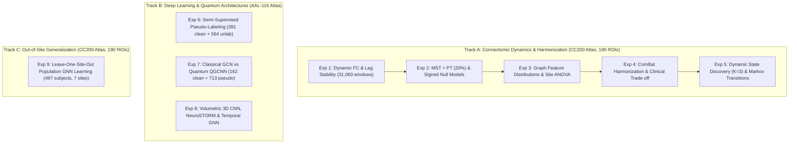

# ADHD-200 Dynamic Functional Connectomics & Graph Neural Architectures

[](LICENSE)
[](configs/exp09/w2b_environment.json)
[](configs/exp09/w2b_environment.json)
[](configs/exp09/w2b_environment.json)
[](configs/exp09/w2b_environment.json)

Authoritative research repository and source-of-truth code artifact accompanying our multi-site psychiatric neuroimaging study on the **ADHD-200 Consortium** dataset.

This repository provides reproducible implementations, verified result ledgers, execution environments, and engineering validation suites for dynamic functional connectivity (dFC), dual-constraint graph modeling, empirical Bayes (ComBat) scanner harmonization, classical and quantum graph convolutional neural networks, volumetric deep learning baselines, and multi-site Leave-One-Site-Out (LOSO) population graph learning.

---

## 1. Repository Architecture

```text
ADHD200/
├── README.md                      # Authoritative repository overview & entry point
├── CITATION.cff                   # Formal citation metadata for publication
├── LICENSE                        # MIT open-source license
├── NOTICE                         # Third-party attributions (NeuroSTORM Apache-2.0, BCT)
├── pyproject.toml                 # Standard packaging and dependency definition
├── .gitignore                     # Git tracking exclusions
│
├── configs/                       # Configuration schemas & recorded execution environments
│   └── exp09/                     # Hardware & software environment metadata (A100, CUDA 12.1)
│
├── data/                          # Data governance & boundary definitions
│   ├── README.md                  # Instructions for acquiring ADHD-200 imaging datasets
│   └── provenance/                # Explicit records of excluded large files (>100 MiB)
│
├── environment/                   # Track-specific requirements & dependency manifests
│   ├── README.md                  # Overview of environment reconstruction
│   ├── track_a/requirements.txt   # Connectomics & harmonization stack
│   ├── track_b/requirements.txt   # GNN, PennyLane quantum, and 3D volumetric stack
│   └── track_c/requirements.txt   # Population graph learning & LOSO stack
│
├── src/                           # Modular source code and training entry points
│   ├── exp02/                     # Dual-constraint graph algorithms & signed null models
│   ├── exp07/                     # Classical GCN, vectorized Quantum GCNN, & utility pipeline
│   │   ├── classical_models/      # Classical GCN training and architecture
│   │   ├── quantum_models/        # Vectorized PennyLane broadcasted quantum embeddings
│   │   └── utils/                 # Self-contained data loaders, graph builders, & training loops
│   └── exp08/                     # Deep learning baseline implementations
│       └── neurostorm/            # NeuroSTORM spatio-temporal transformer (Apache-2.0)
│
├── notebooks/                     # Canonical executed Jupyter notebooks (Exp 01 - 09)
│
├── results/                       # Canonical lightweight result artifacts & verification outputs
│   ├── exp01/                     # dFC lag validation and Frobenius distance tables
│   ├── exp02/                     # Dual-constraint graph metrics across 31,060 windows
│   ├── exp03/                     # Metric distributions & cross-site ANOVA tables
│   ├── exp04/                     # ComBat harmonization comparisons & site/diagnosis trade-offs
│   ├── exp05/                     # Dynamic brain micro-states & Markovian transition dynamics
│   ├── exp06/                     # Semi-supervised pseudo-labeling verification records
│   ├── exp07/                     # Out-of-sample Classical vs Quantum test evaluations (N=33)
│   ├── exp08/                     # Volumetric 3D CNN, NeuroSTORM, & temporal GNN results
│   └── exp09/                     # 7-fold Leave-One-Site-Out (LOSO) complete metric tables
│
├── docs/                          # Authoritative scientific & engineering documentation
│   ├── experiments/               # Modular per-experiment design & audit reports
│   │   ├── exp01.md ... exp09.md  # Detailed documentation for each experiment
│   ├── provenance/                # Source-of-truth ledgers & discrepancy tracking
│   │   ├── source_of_truth.md     # Primary evidence ledger mapping cells to artifacts
│   │   ├── paper_vs_code.md       # Comprehensive documentation of paper vs code mismatches
│   │   └── reproducibility_status.md # Audit verification badges & status
│   └── reproduction.md            # Hardware, installation, and end-to-end execution guide
│
├── scripts/                       # Repository validation and maintenance utilities
│   ├── audit_repo.py              # Automated repository integrity & file health audit
│   └── validate_results.py        # Numerical assertion suite checking result artifacts
│
├── tests/                         # Pytest unit and integration test suite
│   ├── test_imports.py            # Validates module importability across all tracks
│   ├── test_graph_utils.py        # Asserts graph tensor shapes and partition disjointness
│   ├── test_configs.py            # Verifies configuration parameters and environment schemas
│   └── test_result_schema.py      # Asserts CSV and JSON artifact schema validity
│
└── third_party/                   # Third-party licenses, notices, and references
    └── README.md                  # Upstream repository provenance and licenses
```

---

## 2. Experimental Tracks & Decoupled Architecture

The repository is organized into three distinct, historically decoupled experimental tracks:



> [!IMPORTANT]
> **Track Decoupling Notice**:
> Track B (Experiments 6–8) uses the Automated Anatomical Labeling atlas (AAL-116), whereas Tracks A and C use the Craddock-200 atlas (CC200, 190 active ROIs). Furthermore, Experiment 6 (391 clean subjects) and Experiment 7 (162 clean + 713 pseudo subjects) were executed on independent cohort partitions. They are explicitly separated in the codebase.

---

## 3. Executive Summary of Audited Results

All figures and metrics below trace directly to verified result artifacts in `results/`:

| Exp | Title | Primary Representation | Key Audited Finding | Result Artifact | Documentation |
| :---: | :--- | :--- | :--- | :--- | :---: |
| **01** | Dynamic FC Stability | CC200 (190 ROIs, $W=30, S=5$) | Monotonic temporal correlation decay: Lag 1 ($0.8990$) $\to$ Lag 4 ($0.5467$) | [`results/exp01/`](file:///c:/Users/Yash%20Bhardwaj/Downloads/ADHD200_GitHub_Staging/results/exp01/) | [exp01.md](file:///c:/Users/Yash%20Bhardwaj/Downloads/ADHD200_GitHub_Staging/docs/experiments/exp01.md) |
| **02** | Dual-Constraint Graphs | MST + PT ($\rho=0.20$, 3,591 edges) | Verified small-world organization across 31,060 windows ($\sigma = 1.0132 \pm 0.0103$) | [`results/exp02/`](file:///c:/Users/Yash%20Bhardwaj/Downloads/ADHD200_GitHub_Staging/results/exp02/) | [exp02.md](file:///c:/Users/Yash%20Bhardwaj/Downloads/ADHD200_GitHub_Staging/docs/experiments/exp02.md) |
| **03** | Topological Variance & ANOVA | Windowed network features | Massive scanner batch effects ($F = 4,609.76, p < 10^{-300}$ for efficiency across 8 sites) | [`results/exp03/`](file:///c:/Users/Yash%20Bhardwaj/Downloads/ADHD200_GitHub_Staging/results/exp03/) | [exp03.md](file:///c:/Users/Yash%20Bhardwaj/Downloads/ADHD200_GitHub_Staging/docs/experiments/exp03.md) |
| **04** | ComBat Harmonization | NeuroCombat empirical Bayes | Site accuracy dropped $58.64\% \to 31.29\%$; diagnosis accuracy dropped $64.53\% \to 59.56\%$ | [`results/exp04/`](file:///c:/Users/Yash%20Bhardwaj/Downloads/ADHD200_GitHub_Staging/results/exp04/) | [exp04.md](file:///c:/Users/Yash%20Bhardwaj/Downloads/ADHD200_GitHub_Staging/docs/experiments/exp04.md) |
| **05** | Dynamic Brain States | $K$-Means clustering ($K=3$) | Segregated state dominates dwell time ($6.24$ windows, $49.05\%$ occupancy) | [`results/exp05/`](file:///c:/Users/Yash%20Bhardwaj/Downloads/ADHD200_GitHub_Staging/results/exp05/) | [exp05.md](file:///c:/Users/Yash%20Bhardwaj/Downloads/ADHD200_GitHub_Staging/docs/experiments/exp05.md) |
| **06** | Semi-Supervised Learning | Self-training & Ensembling | Procedure I yielded 552 pseudo-labels; Procedure II yielded 484 pseudo-labels | [`results/exp06/`](file:///c:/Users/Yash%20Bhardwaj/Downloads/ADHD200_GitHub_Staging/results/exp06/) | [exp06.md](file:///c:/Users/Yash%20Bhardwaj/Downloads/ADHD200_GitHub_Staging/docs/experiments/exp06.md) |
| **07** | Classical GCN vs Quantum | AAL-116 (116 nodes, 117 feats) | Classical GCN ($0.7293$ AUC) outperforms 6-qubit QGCNN ($0.6429$ AUC) on 33 test subjects | [`results/exp07/`](file:///c:/Users/Yash%20Bhardwaj/Downloads/ADHD200_GitHub_Staging/results/exp07/) | [exp07.md](file:///c:/Users/Yash%20Bhardwaj/Downloads/ADHD200_GitHub_Staging/docs/experiments/exp07.md) |
| **08** | Volumetric & Temporal Baselines | 4D fMRI volumes & Temporal GNN | 3D CNN achieves $76.19\%$ acc ($0.7316$ AUC); NeuroSTORM achieves $59.10\%$ CV acc | [`results/exp08/`](file:///c:/Users/Yash%20Bhardwaj/Downloads/ADHD200_GitHub_Staging/results/exp08/) | [exp08.md](file:///c:/Users/Yash%20Bhardwaj/Downloads/ADHD200_GitHub_Staging/docs/experiments/exp08.md) |
| **09** | Multi-Site LOSO Evaluation | Population GNNs (7 sites, $N=497$) | Out-of-site collapse: GAT ($0.5752$), SAGE ($0.5502$), GCN ($0.5468$), GIN ($0.5437$ AUC) | [`results/exp09/`](file:///c:/Users/Yash%20Bhardwaj/Downloads/ADHD200_GitHub_Staging/results/exp09/) | [exp09.md](file:///c:/Users/Yash%20Bhardwaj/Downloads/ADHD200_GitHub_Staging/docs/experiments/exp09.md) |

---

## 4. Key Provenance Reconciliations & Audit Findings

During extensive source audits, several critical discrepancies between early draft reports and the executed codebase were identified and formally resolved:

1. **Experiment 1 Numbers**: The actual validation output exhibits a smooth monotonic decay ($0.8990 \to 0.7789 \to 0.6609 \to 0.5467$ with Frobenius distances $32.58 \to 48.75 \to 60.78 \to 70.61$), refuting inaccurate numbers generated in unverified drafts.
2. **Experiment 2 Provenance**: `results/exp04/comparison_table.csv` was previously misattributed to Exp 2; Exp 2's authoritative metrics reside in `results/exp02/graph_metrics.csv`.
3. **Experiment 3 ANOVA Scope**: The ANOVA $F$-statistics ($F > 4,000, p < 10^{-300}$) reflect cross-site scanner differences, **not** clinical diagnostic differences between ADHD and TDC.
4. **Experiment 4 Harmonization Nuance**: ComBat successfully attenuated scanner identification ($58.64\% \to 31.29\%$), but diagnostic classification dropped from $64.53\%$ to $59.56\%$. This reflects sensitivity to site-associated variance rather than simple removal of "true clinical signal."
5. **Experiment 7 Architecture**: The audited Track B pipeline operates on AAL-116 ($116$ nodes, $117$ node features), not 190 nodes. Classical GCN outperforms 6-qubit QGCNN by $+0.0865$ AUC on the 33 held-out test subjects.
6. **Experiment 8 Input Modality**: The Lightweight 3D CNN operates on temporal volumetric functional fMRI sequences ($T=25, 99 \times 117 \times 95$), **not** structural T1 anatomical scans.
7. **Experiment 8 Subject Splitting**: Temporal graph learning was evaluated on strictly disjoint subject-level partitions ($534$ train, $115$ val, $115$ test), disproving prior window-leakage conjectures.
8. **Experiment 9 Protocol Discrepancy**: The executed notebook used `top_10pct` thresholding with weighted edges and self-loops, rather than the paper's stated unweighted MST + 20% distance mapping.

See [`docs/provenance/paper_vs_code.md`](file:///c:/Users/Yash%20Bhardwaj/Downloads/ADHD200_GitHub_Staging/docs/provenance/paper_vs_code.md) for full line-by-line analyses of these discrepancies.

---

## 5. Quick Start & Execution

### 5.1 Environment Setup
```bash
# Clone the repository
git clone https://github.com/ADHD200-Research/ADHD200_Connectomics.git
cd ADHD200_Connectomics

# Create environment (Python 3.12)
conda create -n adhd200 python=3.12.13 -y
conda activate adhd200

# Install dependencies
pip install -r environment/track_b/requirements.txt
```

### 5.2 Verification & Testing Suite
Ensure repository health and numerical consistency by executing the automated test suite:
```bash
# 1. Run repository structural audit
python scripts/audit_repo.py

# 2. Run numerical assertion suite against result artifacts
python scripts/validate_results.py

# 3. Run Pytest unit and integration tests
pytest tests/
```

### 5.3 Executing Classical & Quantum Models (Track B)
```bash
# Train classical GCN baseline
python src/exp07/classical_models/run_experiment.py

# Train hybrid quantum GCNN (requires GPU)
python src/exp07/quantum_models/run_experiment.py
```

For comprehensive step-by-step reproduction instructions across all 9 experiments, refer to [`docs/reproduction.md`](file:///c:/Users/Yash%20Bhardwaj/Downloads/ADHD200_GitHub_Staging/docs/reproduction.md).

---

## 6. Data Availability & Boundaries
Raw fMRI scans and large intermediate arrays ($>100\text{ MiB}$) are excluded from GitHub staging to comply with repository quotas and consortium agreements. All derived tabular metrics, manifests, and confusion matrices are staged in `results/`. Refer to [`data/README.md`](file:///c:/Users/Yash%20Bhardwaj/Downloads/ADHD200_GitHub_Staging/data/README.md) and [`data/provenance/README.md`](file:///c:/Users/Yash%20Bhardwaj/Downloads/ADHD200_GitHub_Staging/data/provenance/README.md) for data access procedures.

---

## 7. Citation & Attribution

If you utilize this repository, its methodology, or audited result artifacts, please cite:

```bibtex
@article{bhardwaj2026evaluating,
  title={Evaluating Dynamic Connectome Topologies and Graph Neural Architectures in Multi-Site Psychiatric Neuroimaging},
  author={Bhardwaj, Yash},
  journal={IEEE Journal of Biomedical and Health Informatics (JBHI)},
  year={2026}
}
```

See [`CITATION.cff`](file:///c:/Users/Yash%20Bhardwaj/Downloads/ADHD200_GitHub_Staging/CITATION.cff) for machine-readable citation metadata, and [`NOTICE`](file:///c:/Users/Yash%20Bhardwaj/Downloads/ADHD200_GitHub_Staging/NOTICE) for third-party software licenses (Apache-2.0 NeuroSTORM and BCT).
