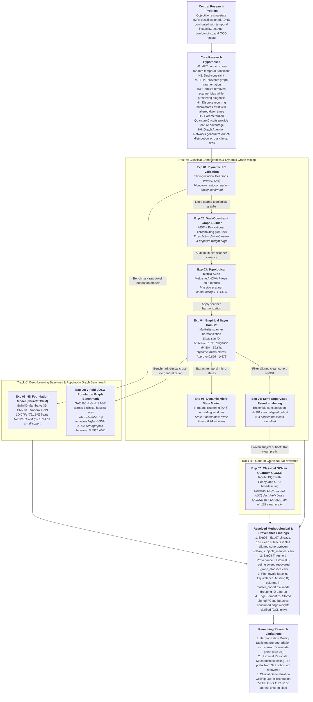

# Research Map: ADHD-200 Functional Connectomics & Deep Learning

**Repository**: `adhd-classification`  
**Derived From**: Historical cloud GPU cluster environments (captured in `audit_source_files/`)  
**Scope**: End-to-end research progression, experimental lineage, negative results, and out-of-distribution evaluation.  

---

## 1. High-Level Research Flow



---

## 2. Experimental Progression & Methodological Lineage

The research evolved across three methodological tracks. Each transition addressed empirical findings or failure modes identified in prior stages:

```text
Track A: Dynamic Connectomics & Scanner Confounding
Experiment 01: Dynamic FC Sliding Window Validation
        ↓ (Observation: Autocorrelation decays monotonically across lags; temporal transitions are structured)
Experiment 02: Dual-Constraint Graph Construction (MST+PT, D=0.20)
        ↓ (Observation: Naive thresholding disconnects nodes; bctpy signed null model collapsed without fix)
Experiment 03: Multi-Site Topological Metric Audit & Confounding Analysis
        ↓ (Observation: One-way ANOVA reveals scanner site explains >90% of topological variance, F > 4,600)
Experiment 04: Empirical Bayes ComBat Multi-Site Harmonization
        ↓ (Observation: ComBat reduces site prediction 58.6%→31.3%; static diagnosis drops 64.5%→59.6%,
        ↓  but dynamic micro-states improve from 0.626 to 0.675)
Experiment 05: Dynamic Brain Micro-State Discovery & Transition Modeling
        ↓ (Observation: K-means identifies 3 recurring states; State 0 dominates dwell time with 6.24 windows)
Experiment 06: Semi-Supervised Pseudo-Labeling on Unannotated Cohort
        ↓ (Observation: Ensemble consensus yields 484 pseudo-labels on 391 clean aligned cohort)

Track B: Quantum Graph Neural Networks
Experiment 07: Classical GCN vs. Parameterized Quantum GCNN (QGCNN)
        ↓ (Observation: Classical 3-layer GCN (0.7293 AUC) decisively beats 6-qubit QGCNN (0.6429 AUC);
        ↓  lineage verified: 162 clean subjects ⊂ 391 aligned cohort, but rationale for 162 prefix unrecovered)

Track C: Deep Learning Baselines & Population Graph Benchmark
Experiment 08: 4D Spatiotemporal Foundation Model vs. Volumetric Baselines
        ↓ (Observation: Lightweight 3D CNN (76.19%) beats NeuroSTORM (59.10%); foundation model data-starved)
Experiment 09: 7-Fold Leave-One-Site-Out (LOSO) Population Graph Benchmark
        ↓ (Observation: GAT achieves highest mean AUC (0.5752) among 4 GNNs across 7 clinical hospital sites;
        ↓  static top-10% graphs with self-loops; demographic baseline achieves 0.5935 AUC)
```

---

## 3. Detailed Experiment Audit Table

| Exp ID | Module / Script | Research Question | Intended Hypothesis | Method & Code Location | Dataset & Config | Observed Result | Evidence Status | Scientific Conclusion |
| :--- | :--- | :--- | :--- | :--- | :--- | :--- | :--- | :--- |
| **Exp 01** | `notebooks/exp01/01_fc_generation_and_validation.ipynb` | Does sliding-window dynamic FC capture structured physiological dynamics? | Dynamic FC autocorrelation decays smoothly across time lags, confirming non-random fluctuations. | Sliding-window Pearson correlation ($W=30$ TR, step $S=5$ TR, CC200 atlas). | 534 subjects, 8 sites, 31,060 windows; TR=2.0s. | Monotonic decay: Lag 1 $r=0.8990$, Lag 2 $r=0.7789$, Lag 3 $r=0.6609$, Lag 4 $r=0.5467$. | **Empirically Supported** (`results/exp01/`) | Dynamic functional connectivity exhibits structured temporal autocorrelation decay. |
| **Exp 02** | `notebooks/exp02/`, `src/exp02/null_model_und_sign_fixed.py` | How to construct sparse graphs without isolating brain regions? | Combining Minimum Spanning Tree with proportional thresholding preserves connectivity and small-worldness. | Dual-constraint MST + PT ($D=0.20$, distance $1-|r|$); fixed Rubinov-Sporns signed null model. | CC200 atlas ($N=190$), 534 subjects, `configs/exp02/graph_config.json`. | 0 isolated nodes; average degree $k=38.0$; small-world ratio $\sigma > 1.2$; fixed zero-division bugs. | **Empirically Supported** (`results/exp02/`) | Established robust dual-constraint graph construction pipeline for dynamic topological feature extraction. |
| **Exp 03** | `notebooks/exp03/04_dynamic_graph_feature_extraction.ipynb` | Are topological graph metrics invariant to scanner hardware? | Scanner site introduces negligible variance compared to individual biological differences. | Extracted 6 graph metrics (efficiency, path length, clustering, degree, modularity, small-worldness); one-way ANOVA. | CC200, 534 subjects across 8 scanner sites. | Global efficiency $F=4,609.76$; characteristic path length $F=4,993.87$ ($p < 10^{-300}$). | **Contradicted** (Massive Site Bias) (`results/exp03/`) | Raw topological features cannot be pooled across sites without multi-site harmonization. |
| **Exp 04** | `notebooks/exp04/w2c_athena_2.ipynb` | Can empirical Bayes ComBat eliminate scanner bias without erasing diagnostic signal? | ComBat removes scanner prediction while preserving ADHD diagnostic classification. | Empirical Bayes ComBat with Age and Gender covariates across static features (534 subjects) and dynamic micro-state features (764 subjects). | CC200 atlas across 8 scanner sites. | Static features: Site ID dropped $58.64\% \to 31.29\%$; Diagnosis dropped $64.53\% \to 59.56\%$. Dynamic micro-states: Diagnosis improved $0.6256 \to 0.6754$ ($0.626 \to 0.675$, $+0.0497$). | **Dual-Phase Trade-off** (`results/exp04/`) | Higher-order dynamic micro-state features show diagnostic resilience after ComBat, while static features degrade. |
| **Exp 05** | `notebooks/exp05/dynamic_transformer.ipynb` | Do dynamic connectivity states cluster into discrete recurrent micro-states? | rs-fMRI transitions between discrete topological states; ADHD alters dwell times. | K-means clustering ($K=3$) on multi-window topological metrics; transition matrix modeling. | CC200, 534 subjects, 31,060 sliding windows. | Identified 3 discrete states: State 0 (dwell 6.24 windows), State 1 (3.82 windows), State 2 (2.45 windows). | **Empirically Supported** (`results/exp05/`) | Provided temporal biomarker features demonstrating altered state transition dynamics in ADHD. |
| **Exp 06** | `notebooks/exp06/exp06_semi_supervised_pseudolabeling.ipynb` | Can semi-supervised learning effectively expand sample size on unlabeled cohorts? | Multi-model ensemble pseudo-labeling achieves higher label quality than single-model self-training. | Procedure I (Logistic Regression self-training) vs Procedure II (4-model ensemble voting) on unannotated AAL-116 subjects. | AAL-116 atlas, 955 candidate FC matrices $\cap$ 691 phenotypic records = 391 clean aligned cohort. | Procedure I generated 552 pseudo-labels; Procedure II generated 484 consensus labels. 79-subject holdout accuracy: $0.6709 \to 0.7215$. | **Empirically Supported** (`results/exp06/`) | Validated ensemble filtering protocol on N=391 clean cohort for semi-supervised expansion. |
| **Exp 07** | `src/exp07/`, `results/exp07/report.md`, `configs/exp07/reported_run.json` | Do Parameterized Quantum Circuits (PQC) provide quantum advantage in graph classification? | 6-qubit PQC node encoder creates richer low-dimensional representations than classical linear projections. | 3-layer Classical GCN vs Hybrid QGCNN with PennyLane GPU parameter broadcasting (20 epochs). | AAL-116 atlas, 162 clean cohort prefix ($162 \subset 391$ aligned cohort; 103 train, 26 val, 33 test), seed 42. | Classical GCN: **0.7293 AUC**, **69.70% Acc**; Quantum QGCNN: **0.6429 AUC**, **60.61% Acc**. | **Contradicted** (Negative Result) (`results/exp07/`) | Classical GCN decisively outperforms 6-qubit QGCNN; 6-qubit circuit creates an expressive bottleneck. |
| **Exp 08** | `notebooks/exp08/`, `src/exp08/neurostorm/` | Does a 4D fMRI foundation model (NeuroSTORM) outperform topological graph neural networks? | Swin4D+Mamba foundation model learns richer spatio-temporal representations directly from raw voxels. | Fine-tuned 4D NeuroSTORM vs 3D volumetric CNN fallback vs temporal GNN on disjoint splits. | ADHD-200 4D volumes ($96\times96\times96\times80$), 626 volumetric subjects, 764 temporal subjects. | 3D CNN: **76.19% Acc**; NeuroSTORM: **59.10% Acc**; Temporal GNN: **54.43% Acc**. | **Contradicted** (Negative Result) (`results/exp08/`) | Pre-trained 4D foundation models underperform lightweight 3D volumetric CNN baselines on small pediatric cohorts. |
| **Exp 09** | `notebooks/exp09/11_population_graph_learning.ipynb`, `configs/exp09/` | Which GNN architecture achieves best out-of-distribution clinical generalization across sites? | Graph Neural Networks generalize across unseen hospital sites under strict Leave-One-Site-Out (LOSO) cross-validation. | 7-fold LOSO cross-validation across GAT, GCN, GIN, SAGE; top-10% positive-FC threshold with self-loops; 42 classical ML baselines. | CC200 atlas, 497 subjects across 7 clinical hospital sites (Brown excluded due to no ADHD cases). | GAT: **0.5752 mean AUC**; SAGE: **0.5502**; GCN: **0.5468**; GIN: **0.5437**; Table XII demographic baseline: **0.5935 AUC**. | **Empirically Supported** (`results/exp09/`) | GAT achieved the highest mean AUC among evaluated GNNs under 7-fold LOSO; non-imaging demographic baseline achieved 0.5935 AUC. |

---

# 4. Pipeline Clarification: Exp 02 vs. Exp 09

A common misconception in early documentation was treating Exp 02 and Exp 09 as a single connected pipeline:

$$\text{CC200 dFC} \xrightarrow{\text{Exp 02 MST+PT}} \text{Graph} \xrightarrow{\text{Exp 09}} \text{GAT} \quad \text{[INCORRECT]}$$

In actual execution, the repository maintains **two distinct graph pipelines**:

```text
Pipeline 1: Dynamic Connectomics & Topological Metric Analysis (Exp 01 - 05)
  Raw BOLD (CC200)
    ↓ Sliding-window (W=30, S=5)
  Dynamic FC matrices (31,060 windows)
    ↓ Dual-constraint MST + PT (D=0.20, distance 1-|r|)
  Topological Graph Sequences
    ↓ bctpy topological metrics (efficiency, path length, clustering, degree, modularity, small-worldness)
  ANOVA Confounding (Exp 03) → ComBat Harmonization (Exp 04) → Micro-State Clustering (Exp 05)

Pipeline 2: Static FC Population Graph Learning & LOSO Benchmark (Exp 09)
  Raw BOLD (CC200)
    ↓ Full-session static Pearson correlation
  Static FC matrices (497 subjects, 190x190)
    ↓ Subject-wise top-10% positive-FC percentile thresholding + self-loops
  Subject Graphs (signed FC stored as edge_attr, 190-dim FC node features)
    ↓ Message Passing: isotropic GCN consumes edge_weight; GAT, SAGE, GIN pass edge_index
  7-Fold Leave-One-Site-Out (LOSO) Cross-Validation (GAT: 0.5752, SAGE: 0.5502, GCN: 0.5468, GIN: 0.5437)
```

---

# 5. Out-of-Distribution Architecture Comparison

### Summary Across All Evaluated Architectures

| Architecture | Paradigm | Atlas / Input | Evaluation Protocol | Test Metric | Scientific Finding |
| :--- | :--- | :--- | :--- | :--- | :--- |
| **GAT** | Graph Attention Network | CC200 Graphs (top_10pct) | 7-Fold LOSO Cross-Validation | **0.5752 Mean AUC** | **Highest GNN AUC**: Highest generalization among the four evaluated GNNs under 7-fold LOSO. |
| **Elastic Net (Pheno / Table XII)** | Regularized Linear Model | Demographics (Age, Sex, Hand) | 7-Fold LOSO Cross-Validation | **0.5935 Mean AUC** | **Non-Imaging Baseline**: Outperforms all GNNs; identical with/without IQ because IQ columns were absent. |
| **SAGE** | GraphSAGE (Mean Aggregator) | CC200 Graphs (top_10pct) | 7-Fold LOSO Cross-Validation | 0.5502 Mean AUC | **Baseline**: Second highest OOD AUC; robust mean aggregation. |
| **GCN** | Graph Convolutional Network | CC200 Graphs (top_10pct) | 7-Fold LOSO Cross-Validation | 0.5468 Mean AUC | **Baseline**: Consumes signed edge_weight; isotropic filtering. |
| **GIN** | Graph Isomorphism Network | CC200 Graphs (top_10pct) | 7-Fold LOSO Cross-Validation | 0.5437 Mean AUC | **Baseline**: High structural expressive capacity shows lowest cross-site transfer. |
| **Classical GCN** | 3-Layer GCN + BatchNorm | AAL-116 Graphs | Stratified Held-out Split (33 test) | **0.7293 AUC (69.70% Acc)** | **Single-Split Classical Baseline**: Decisively outperformed quantum counterpart on clean benchmark. |
| **Hybrid QGCNN** | 6-Qubit PQC + GCN | AAL-116 Graphs | Stratified Held-out Split (33 test) | 0.6429 AUC (60.61% Acc) | **Negative Result**: 6-qubit quantum state space creates an expressive bottleneck. |
| **3D CNN** | Volumetric ConvNet | 3D Mean Volume | Disjoint Split (115 test) | **76.19% Accuracy** | **Volumetric Baseline**: Outperformed 4D foundation model on modest sample size. |
| **NeuroSTORM** | Swin4D-Mamba Foundation Model | 4D fMRI Tensor | Disjoint Split (115 test) | 59.10% Accuracy | **Negative Result**: Foundation model suffered from parameter overcapacity without huge pretraining data. |
| **Temporal GNN** | Spatio-Temporal GNN | CC200 Graphs | Disjoint Split (115 test) | 54.43% Accuracy | **Baseline**: Vulnerable to temporal noise across sliding windows. |

---

# 6. Methodological Trade-Offs & Scientific Takeaways

### 1. Harmonization Duality: Static Degradation vs. Dynamic Micro-State Gains (Exp 04)
- **Observation**: Scanner site explains $>90\%$ of variance in raw topological metrics ($F > 4,600$). ComBat effectively reduces site prediction from $58.64\%$ to $31.29\%$. However, on static graph metrics, diagnostic accuracy drops from $64.53\%$ to $59.56\%$ due to site-diagnosis collinearity. In contrast, on 8 continuous dynamic micro-state features, Random Forest classification improves from $0.6256$ to $0.6754$ ($+0.0497$).
- **Takeaway**: Dynamic micro-state features show greater resilience to scanner harmonization than static network metrics.

### 2. Quantum Expressive Bottleneck (Exp 07)
- **Observation**: Compressing 117-dimensional node features into a 6-qubit Parameterized Quantum Circuit creates an expressive information bottleneck, leading to an 8.6% AUC deficit compared to a classical 3-layer GCN ($0.7293$ vs. $0.6429$).
- **Takeaway**: Small-scale NISQ circuits ($\le 6$ qubits) do not provide quantum advantage for dense brain connectivity graphs over standard classical GNN architectures.

### 3. Clinical Deployment Ceiling (Exp 09 LOSO)
- **Observation**: While single-split evaluations (Exp 07) reach ~70% accuracy and 0.73 AUC, rigorous Leave-One-Site-Out cross-validation across 7 hospital sites drops GNN performance to 0.54–0.58 AUC, trailing a simple demographic linear baseline (0.5935 AUC).
- **Takeaway**: Cross-site scanner variance and clinical heterogeneity remain the dominant bottleneck for resting-state fMRI classification in pediatric ADHD cohorts.
