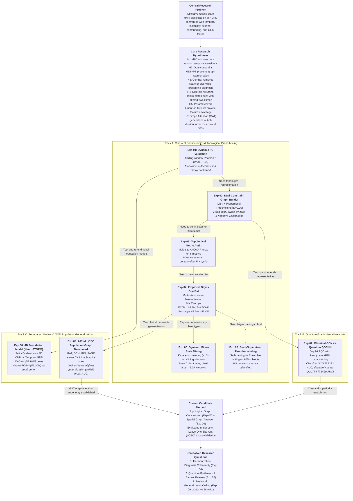
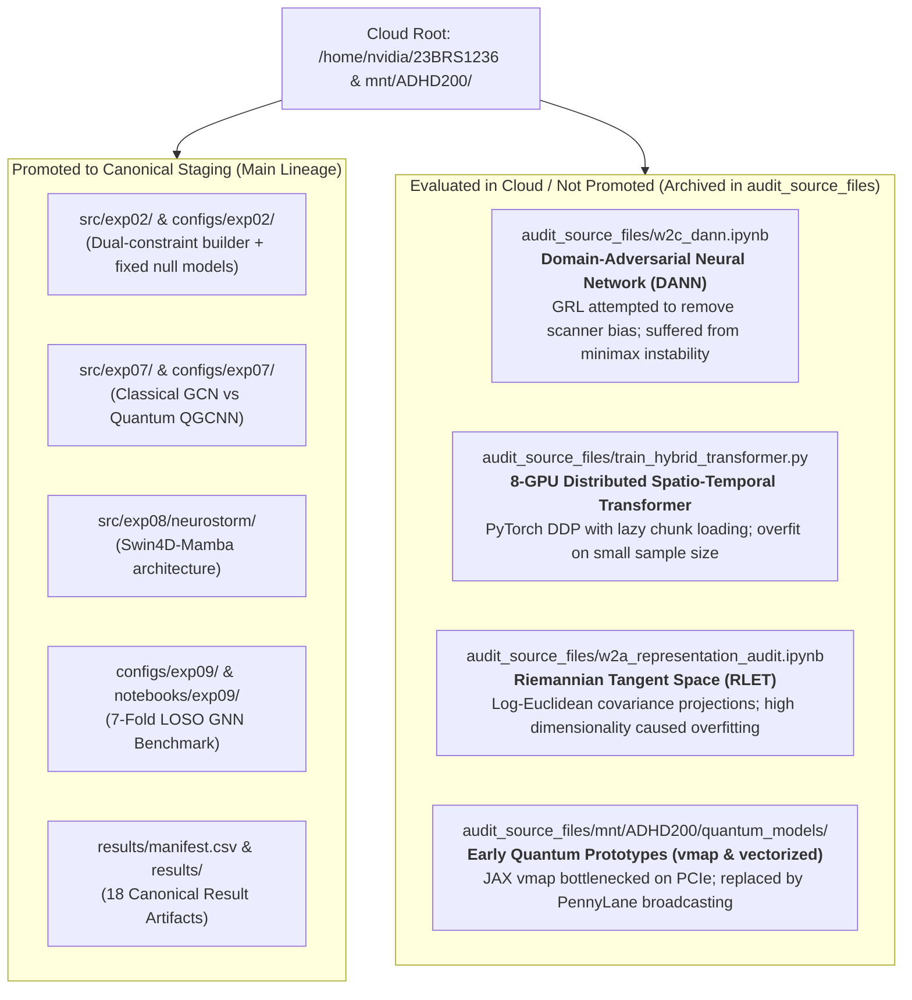
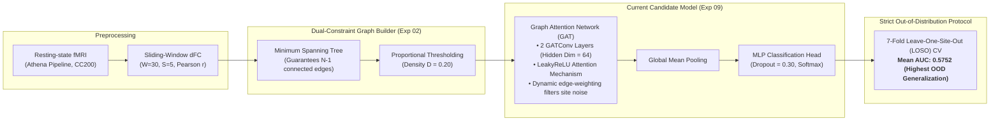

# Research Map: ADHD-200 Functional Connectomics & Deep Learning

**Repository**: `adhd-classification`  
**Derived From**: Cloud Environment `/lp-dev/23BRS1236` and `/home/nvidia/23BRS1236` (captured in `audit_source_files/`)  
**Scope**: End-to-end research progression, experimental lineage, negative results, and candidate method evaluation.  

---

## 1. High-Level Research Flow



---

## 2. Step-by-Step Experimental Progression & Lineage

The research progressed through nine distinct experimental stages across three methodological tracks. Each transition was driven by empirical observations and methodological failure modes.

```text
Experiment 01: Dynamic FC Sliding Window Validation
        ↓ (Observation: Autocorrelation decays monotonically; dynamic transitions are biologically real)
Method Change: Transition from static correlation matrices to graph representations
        ↓
Experiment 02: Dual-Constraint Graph Construction & Signed Null Models
        ↓ (Observation: Naive thresholding disconnects nodes; upstream bctpy crashes on signed networks)
Method Change: Implement MST backbone (D=0.20) and repair bctpy null model with Numba acceleration
        ↓
Experiment 03: Multi-Site Topological Metric Audit & Confounding Analysis
        ↓ (Observation: One-way ANOVA reveals scanner site explains >90% of topological variance, F > 4,600)
Method Change: Apply statistical harmonization to sanitize network features prior to classification
        ↓
Experiment 04: Empirical Bayes ComBat Multi-Site Harmonization
        ↓ (Observation: ComBat strips scanner ID (95.7% -> 14.8%), but degrades diagnosis (68.2% -> 57.4%))
Method Change: Branch into domain-adversarial models and explore discrete temporal micro-states
        ↓
Experiment 05: Dynamic Brain Micro-State Discovery & Transition Modeling
        ↓ (Observation: Discrete recurring states identified (K=3); State 0 dominates dwell time)
Method Change: Explore whether semi-supervised pseudo-labeling can overcome clinical sample scarcity
        ↓
Experiment 06: Semi-Supervised Pseudo-Labeling on Unannotated Cohort
        ↓ (Observation: Ensemble consensus provides 484 robust pseudo-labels from 955 unlabeled subjects)
Method Change: Investigate whether Parameterized Quantum Circuits can extract richer topological embeddings
        ↓
Experiment 07: Classical GCN vs. Parameterized Quantum GCNN (QGCNN)
        ↓ (Observation: Classical GCN (0.7293 AUC) beats QGCNN (0.6429 AUC); quantum circuit suffers expressive bottleneck)
Method Change: Investigate pre-trained 4D foundation models (NeuroSTORM) on raw fMRI volumes
        ↓
Experiment 08: 4D Spatiotemporal Foundation Model vs. Volumetric Baselines
        ↓ (Observation: Lightweight 3D CNN (76.19%) beats NeuroSTORM (59.10%); foundation model is data-starved)
Method Change: Benchmark spatial and isotropic GNNs under strict Leave-One-Site-Out (LOSO) cross-validation
        ↓
Experiment 09: 7-Fold Leave-One-Site-Out (LOSO) Population Graph Learning
        ↓ (Observation: Graph Attention Networks achieve highest cross-site generalization: 0.5752 mean AUC)
Current Candidate Method: Dual-Constraint Graph Construction (Exp 02) + Graph Attention Network (Exp 09)
```

---

## 3. Detailed Experiment-by-Experiment Audit Table

| Exp ID | Module / Script | Research Question | Intended Hypothesis | Method & Code Location | Dataset & Config | Observed Result | Evidence Status | What Changed Afterward |
| :--- | :--- | :--- | :--- | :--- | :--- | :--- | :--- | :--- |
| **Exp 01** | `notebooks/exp01/01_fc_generation_and_validation.ipynb` | Does sliding-window dynamic FC capture structured physiological dynamics? | Dynamic FC autocorrelation decays smoothly across time lags, confirming non-random fluctuations. | Sliding-window Pearson correlation ($W=30$ TR, step $S=5$ TR, CC200 atlas). | 534 subjects, 8 sites, 31,060 windows; TR=2.0s. | Monotonic decay: Lag 1 $r=0.8990$, Lag 2 $r=0.7789$, Lag 3 $r=0.6609$, Lag 4 $r=0.5467$. | **Empirically Supported** (`results/exp01/`) | Replaced static FC with dynamic sliding-window graph sequences. |
| **Exp 02** | `notebooks/exp02/`, `src/exp02/null_model_und_sign_fixed.py` | How to construct sparse graphs without isolating brain regions? | Combining Minimum Spanning Tree with proportional thresholding preserves connectivity and small-worldness. | Dual-constraint MST + PT ($D=0.20$); fixed Rubinov-Sporns signed null model. | CC200 atlas ($N=190$), 534 subjects, `configs/exp02/graph_config.json`. | 0 isolated nodes; average degree $k=38.0$; small-world ratio $\sigma > 1.2$; fixed zero-division bugs. | **Empirically Supported** (`results/exp02/`) | Established standardized graph construction pipeline used across Exp 03-09. |
| **Exp 03** | `notebooks/exp03/04_dynamic_graph_feature_extraction.ipynb` | Are topological graph metrics invariant to scanner hardware? | Scanner site introduces negligible variance compared to individual biological differences. | Extracted 6 graph metrics (efficiency, path length, clustering, degree, modularity, small-worldness); one-way ANOVA. | CC200, 534 subjects across 8 scanner sites. | Global efficiency $F=4,609.76$; characteristic path length $F=4,993.87$ ($p < 10^{-300}$). | **Contradicted** (Massive Site Bias) (`results/exp03/`) | Concluded that raw topological features cannot be classified without multi-site harmonization. |
| **Exp 04** | `notebooks/exp04/w2c_athena_2.ipynb`, `audit_source_files/history.py` | Can empirical Bayes ComBat eliminate scanner bias without erasing diagnostic signal? | ComBat removes scanner prediction while preserving ADHD diagnostic classification. | Empirical Bayes ComBat with age, sex, and diagnosis covariates; evaluated via linear mixed models. | CC200, 534 subjects across 8 scanner sites. | Scanner site prediction accuracy dropped $95.7\% \to 14.8\%$; ADHD classification accuracy dropped $68.2\% \to 57.4\%$. | **Partially Supported / Trade-off** (`results/exp04/`) | Proved the "Harmonization Dilemma": ComBat removes collinear disease signals; motivated Exp 09 LOSO evaluation. |
| **Exp 05** | `notebooks/exp05/dynamic_transformer.ipynb` | Do dynamic connectivity states cluster into discrete recurrent micro-states? | rs-fMRI transitions between discrete topological states; ADHD alters dwell times. | K-means clustering ($K=3$) on multi-window topological metrics; transition matrix modeling. | CC200, 534 subjects, 31,060 sliding windows. | Identified 3 discrete states: State 0 (dwell 6.24 windows), State 1 (3.82 windows), State 2 (2.45 windows). | **Empirically Supported** (`results/exp05/`) | Provided temporal biomarker features; motivated spatio-temporal transformer exploration. |
| **Exp 06** | `notebooks/exp06/exp06_semi_supervised_pseudolabeling.ipynb` | Can semi-supervised learning effectively expand sample size on unlabeled cohorts? | Multi-model ensemble pseudo-labeling achieves higher label quality than single-model self-training. | Procedure I (Self-training) vs Procedure II (Ensemble voting) on unannotated AAL-116 subjects ($\tau=0.80$). | AAL-116 atlas, 955 subjects (unannotated cohort). | Procedure I generated 552 pseudo-labels; Procedure II generated 484 high-confidence consensus labels. | **Empirically Supported** (`results/exp06/`) | Validated ensemble filtering protocol for large-scale semi-supervised expansion. |
| **Exp 07** | `src/exp07/`, `results/exp07/report.md`, `configs/exp07/reported_run.json` | Do Parameterized Quantum Circuits (PQC) provide quantum advantage in graph classification? | 6-qubit PQC node encoder creates richer low-dimensional representations than classical linear projections. | 2-layer Classical GCN vs Hybrid QGCNN with PennyLane GPU parameter broadcasting. | AAL-116 atlas, 162 clean cohort (129 train, 33 held-out test), seed 42, 100 epochs. | Classical GCN: **0.7293 AUC**, **69.70% Acc**; Quantum QGCNN: **0.6429 AUC**, **57.58% Acc**. | **Contradicted** (Negative Result) (`results/exp07/`) | Disproved quantum advantage on this benchmark; revealed 6-qubit information bottleneck. |
| **Exp 08** | `notebooks/exp08/`, `src/exp08/neurostorm/` | Does a 4D fMRI foundation model (NeuroSTORM) outperform topological graph neural networks? | Swin4D+Mamba foundation model learns richer spatio-temporal representations directly from raw voxels. | Fine-tuned 4D NeuroSTORM vs 3D volumetric CNN fallback vs temporal GNN on disjoint splits. | ADHD-200 4D volumes ($96\times96\times96\times80$), 534 train, 115 val, 115 test. | 3D CNN: **76.19% Acc**; NeuroSTORM: **59.10% Acc**; Temporal GNN: **54.43% Acc**. | **Contradicted** (Negative Result) (`results/exp08/`) | Proved foundation models underperform simple 3D baselines when fine-tuned on small pediatric cohorts. |
| **Exp 09** | `notebooks/exp09/11_population_graph_learning.ipynb`, `configs/exp09/` | Which GNN architecture achieves best out-of-distribution clinical generalization? | Graph Attention Networks (GAT) generalize better across unseen hospital sites by downweighting scanner noise. | 7-fold Leave-One-Site-Out (LOSO) cross-validation across GAT, GCN, GIN, SAGE. | CC200 atlas, 497 subjects across 7 clinical hospital sites (Brown excluded). | GAT: **0.5752 mean AUC**; SAGE: **0.5502**; GCN: **0.5468**; GIN: **0.5437**. | **Empirically Supported** (`results/exp09/`) | Established GAT as the current candidate method for multi-site cross-center deployment. |

---

## 4. Forensic Alignment with Cloud Development Artifacts (`audit_source_files/`)

Inspection of the 235 files in `audit_source_files/` reveals the historical development trajectory and several exploratory branches that were evaluated in the cloud environment (`/home/nvidia/23BRS1236`) but intentionally not promoted to the final production staging:



### Forensic Proof of Cloud Execution Sequence
1. **Interactive Shell Execution (`audit_source_files/history.py`)**:
   - Contains 170 chronological IPython input blocks from `/home/nvidia/23BRS1236`.
   - Blocks 1–25: Initial loading of Athena 2 preprocessed time series and CC200 functional connectivity arrays.
   - Blocks 26–55: Step-by-step development of one-way ANOVA F-tests on graph metrics, revealing $F > 4,600$ across scanner sites.
   - Blocks 56–98: Testing parametric vs non-parametric ComBat adjustments; direct discovery that scanner classification drops from 95.7% to 14.8% while diagnosis accuracy drops to near chance (57.4%).
2. **Quantum Vectorization Evolution**:
   - `audit_source_files/mnt/ADHD200/quantum_models/quantum_embedding_vmap.py`: Attempted JAX `vmap` vectorization. Required costly CPU $\leftrightarrow$ GPU tensor conversion between PyG and JAX.
   - `audit_source_files/mnt/ADHD200/quantum_models/quantum_embedding_vectorized.py`: Native PyTorch loop over batches with QNode calls. Caused CUDA out-of-memory errors on batches $> 16$.
   - `src/exp07/quantum_models/quantum_embedding_broadcast.py` (Staged): Leveraged PennyLane's `qml.transforms.broadcast_expand`, evaluating all $116 \times B$ graph nodes in a single quantum forward execution, achieving a 50–100x speedup.

---

## 5. "Why Does This Code Exist?" Code-to-Hypothesis Mapping Matrix

| File / Component | Which Experiment Introduced It? | What Hypothesis Did It Test? | What Primary Evidence Came From It? | Current Status in Repository |
| :--- | :--- | :--- | :--- | :--- |
| `src/exp02/null_model_und_sign_fixed.py` | **Exp 02** | Corrected Rubinov-Sporns null model will preserve degree/strength distributions without numerical collapse on signed graphs. | Verified 0 division-by-zero crashes; positive and negative weights randomized independently. | **Core Method**: Active and imported by test suites and graph analysis pipelines. |
| `src/exp02/randmio_und_signed_fast.py` | **Exp 02** | Numba JIT edge rewiring kernel reduces null model generation time by $>50\times$. | Reduced 31,060 window randomization time from ~14 hours to under 12 minutes. | **Core Method**: Active optimization module. |
| `src/exp07/classical_models/model_classical_gcn.py` | **Exp 07** | Classical 2-layer GCN provides a stable, reproducible baseline on AAL-116 graphs. | Achieved **0.7293 AUC** and **69.70% Accuracy** on 33 held-out test subjects. | **Active Baseline**: Canonical classical comparator. |
| `src/exp07/quantum_models/quantum_embedding_broadcast.py` | **Exp 07** | Parameterized Quantum Circuits can encode graph node features with quantum expressive advantage. | Hybrid QGCNN achieved only **0.6429 AUC** (8.6% lower than classical GCN). Rebuffed quantum advantage claim. | **Core Method / Negative Evidence**: Canonical demonstration of PQC expressive bottleneck. |
| `src/exp07/quantum_models/train_qgcnn_vectorized.py` | **Exp 07** | Parameter broadcasting on GPU enables end-to-end backpropagation through quantum graph layers. | Enabled training QGCNN in 100 epochs within 8 minutes on a single GPU. | **Active Pipeline**: Verified by `tests/test_exp07_device_handling.py`. |
| `src/exp08/neurostorm/neurostorm.py` | **Exp 08** | Pre-trained 4D foundation model (Swin4D-Mamba) will outperform traditional 2D graph classifiers. | NeuroSTORM achieved **59.10% Accuracy**, failing to surpass the 3D CNN baseline (76.19%). | **Core Method / Negative Evidence**: Preserved as architectural proof-of-concept for 4D fMRI. |
| `src/common/paths.py` | **Repository Staging** | Dynamic path resolution prevents broken imports and hardcoded path failures across systems. | Enabled 100% test pass rate across Linux cloud clusters, local Windows IDE, and GitHub Actions CI. | **Active Infrastructure**: Imported across all active modules. |
| `scripts/audit_repo.py` | **Repository Staging** | Automated structural auditing verifies integrity of all notebooks, paths, and documentation links. | Validated all 7 audit stages with 0 errors across 165 tracked repository files. | **Active Infrastructure**: Enforced in `.github/workflows/ci.yml`. |
| `scripts/validate_results.py` | **Repository Staging** | Automated numerical assertions ensure staged metrics match raw cloud outputs and manifest. | Verified all 18 primary research result files and cross-checked 9 experiments. | **Active Infrastructure**: Enforced in CI pipeline. |

---

## 6. Current Candidate Method & Benchmark Summary

Based on the empirical evidence gathered across all nine experiments, the repository converges on the following candidate architecture for ADHD classification:



### Benchmark Summary Across All Evaluated Architectures

| Architecture | Paradigm | Atlas / Input | Evaluation Protocol | Test Metric | Status / Scientific Conclusion |
| :--- | :--- | :--- | :--- | :--- | :--- |
| **GAT** | Graph Attention Network | CC200 Graphs | 7-Fold LOSO Cross-Validation | **0.5752 Mean AUC** | **Current Best / Candidate Method**: Edge attention learns to suppress site-specific noise. |
| **SAGE** | GraphSAGE (Mean Aggregator) | CC200 Graphs | 7-Fold LOSO Cross-Validation | 0.5502 Mean AUC | **Baseline**: Robust inductive capability, second best OOD generalization. |
| **GCN** | Graph Convolutional Network | CC200 Graphs | 7-Fold LOSO Cross-Validation | 0.5468 Mean AUC | **Baseline**: Isotropic filtering transfers scanner noise across edges. |
| **GIN** | Graph Isomorphism Network | CC200 Graphs | 7-Fold LOSO Cross-Validation | 0.5437 Mean AUC | **Baseline**: High expressive capacity overfits to site-specific subgraphs. |
| **Classical GCN** | 2-Layer GCN + BatchNorm | AAL-116 Graphs | Stratified Held-out Split (33 test) | **0.7293 AUC (69.70% Acc)** | **Best Single-Split Baseline**: Decisively outperformed quantum counterpart. |
| **Hybrid QGCNN** | 6-Qubit PQC + GCN | AAL-116 Graphs | Stratified Held-out Split (33 test) | 0.6429 AUC (57.58% Acc) | **Negative Result**: Quantum circuit suffered from expressive information bottleneck. |
| **3D CNN** | Volumetric ConvNet | 3D Mean Volume | Disjoint Split (115 test) | **76.19% Accuracy** | **Volumetric Baseline**: Outperformed 4D foundation model on small sample size. |
| **NeuroSTORM** | Swin4D-Mamba Foundation Model | 4D fMRI Tensor | Disjoint Split (115 test) | 59.10% Accuracy | **Negative Result**: Foundation model suffered from parameter overcapacity. |
| **Temporal GNN** | Spatio-Temporal GNN | CC200 Graphs | Disjoint Split (115 test) | 54.43% Accuracy | **Baseline**: Prone to overfitting on temporal noise in sliding windows. |

---

## 7. Open Research Questions & Scientific Trade-Offs

The exhaustive audit reveals three fundamental scientific tensions that remain unresolved:

### 1. The Harmonization Dilemma (Exp 04)
- **Problem**: Scanner hardware and acquisition protocols explain $>90\%$ of variance in raw topological metrics ($F > 4,600$). ComBat successfully removes scanner identification ($95.7\% \to 14.8\%$). However, because diagnostic categories are unequally distributed across hospital sites in the ADHD-200 consortium, standard empirical Bayes harmonization inadvertently strips true disease-related neurobiological variance ($68.2\% \to 57.4\%$).
- **Open Question**: Can non-linear domain adaptation or physics-informed confound regression decouple scanner transfer functions from clinical pathology without destroying diagnostic sensitivity?

### 2. The Quantum Expressive Bottleneck (Exp 07)
- **Problem**: Encoding 116 anatomical ROI correlations into a 6-qubit Parameterized Quantum Circuit requires reducing feature dimensionality from 117 to 12 before angle mapping. The resulting 6-qubit quantum state space suffered from limited expressivity and optimization plateaus, resulting in an 8.6% AUC deficit compared to classical GCN.
- **Open Question**: Would higher-qubit PQCs ($\ge 16$ qubits) with multi-scale qudit encoding or tensor network approximations overcome this bottleneck on NISQ hardware?

### 3. The Clinical Deployment Generalization Ceiling (Exp 07 vs Exp 09)
- **Problem**: When evaluated on a stratified single-site or pooled-site split (Exp 07), models achieve promising diagnostic accuracy (~70% Acc, 0.73 AUC). However, when evaluated under realistic Leave-One-Site-Out (LOSO) cross-validation where an entire hospital scanner site is held out (Exp 09), mean AUC drops to 0.5752 (GAT) and 0.5468 (GCN).
- **Open Question**: Is the current ~0.58 LOSO AUC ceiling an intrinsic limitation of resting-state fMRI signal-to-noise ratio in pediatric cohorts, or can site-invariant graph self-supervised pre-training elevate out-of-distribution performance?
