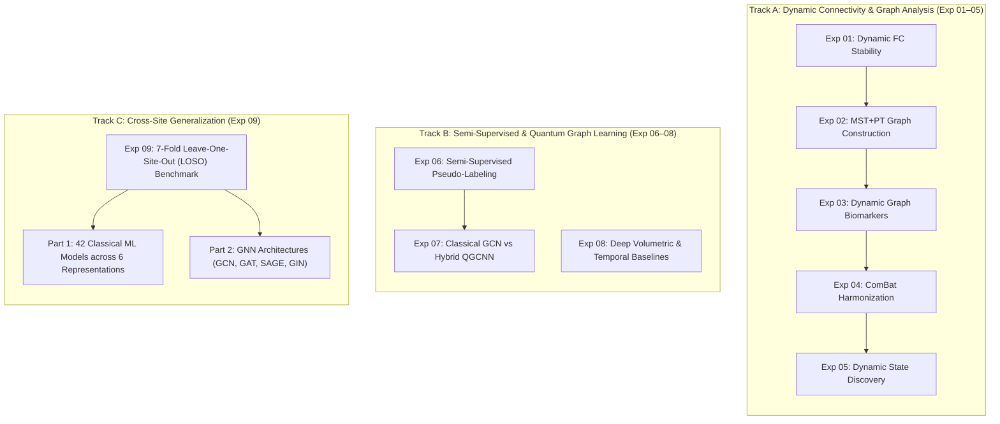

# Study Design & Multi-Track Architecture

This document presents the high-level scientific architecture, research questions, cohort distributions, representation choices, and validation protocols governing the multi-track study.

---

## 1. Research Questions

The study investigates functional brain organization, machine learning representations, and cross-site diagnostic generalizability in the **ADHD-200 Sample** across four core research questions:

1. **RQ1: Temporal Organization of Dynamic Connectivity**: Does resting-state dynamic functional connectivity (dFC) exhibit structured temporal organization and state transitions beyond stationary noise, or do sliding-window correlations decay monotonically toward static representations?
2. **RQ2: Diagnostic Utility of Topological Dispersion**: Does temporal dispersion (variability across time windows) in graph-theoretic network properties capture diagnosis-related variance that is absent in time-averaged static graph metrics?
3. **RQ3: Classical versus Quantum Graph Classification**: Under strictly matched graph topology, node feature dimensions, and training conditions, how does a hybrid Quantum Graph Convolutional Neural Network (QGCNN) compare with an isotropic Classical Graph Convolutional Network (GCN)?
4. **RQ4: Multi-Site Generalizability under Generalization Stress**: How robust are classical machine learning baselines and geometric deep learning architectures (GCN, GAT, GraphSAGE, GIN) when subjected to strict Leave-One-Site-Out (LOSO) cross-validation across heterogeneous clinical imaging sites?

---

## 2. Multi-Track Architecture

To prevent false methodological convergence across incompatible processing assumptions, the study is structured into **three independent, non-merged experimental tracks**:



### Track A — Dynamic Connectivity and Graph Analysis (Experiments 01–05)
Focuses on temporal dynamics, topological graph characterization, scanner harmonization, and data-driven brain state discovery using the Craddock-200 (CC200) atlas with 190 active cortical/subcortical regions.

### Track B — Semi-Supervised and Quantum Graph Classification (Experiments 06–08)
Investigates self-training and ensemble pseudo-label generation on 955 subjects, evaluates an isotropic Classical GCN against a parameterized 6-qubit QGCNN on the AAL-116 atlas, and benchmarks independent 4D volumetric CNNs and temporal graph models.

### Track C — Independent Cross-Site Generalization (Experiment 09)
Establishes an out-of-distribution generalization benchmark using 7-fold Leave-One-Site-Out cross-validation across 497 subjects from 7 scanner sites on the CC200 atlas, directly evaluating 42 classical ML configurations and 4 graph neural network families.

---

## 3. Cohort Structure & Partitioning

The ADHD-200 Sample comprises heterogeneous resting-state acquisitions across international imaging centers. Each experimental track evaluates a rigorously defined cohort partition:

### Track A Cohort (CC200 Atlas, 190 ROIs)
- **Total Population**: 764 unique subjects across 9 sites (`KKI`, `NYU`, `NeuroIMAGE`, `OHSU`, `Peking_1`, `Peking_2`, `Peking_3`, `Pittsburgh`, `WashU`).
- **Acquisitions & Windows**: 1,193 imaging runs yielding 31,060 temporal sliding windows ($W=30$ TRs, stride=5 TRs, 83.3% overlap).
- **Phenotypic Analyses (Exp 03–05)**: Dynamic graph-metric and state discovery artifacts cover the full 764 subjects (31,060 windows); downstream clinical and behavioral analyses reference the 534 phenotypically complete subset across 8 sites.

### Track B Cohort (AAL-116 Atlas, 116 ROIs)
- **Available Connectivity Population**: 955 subjects with AAL-116 time series.
- **Aligned Clean Cohort (Exp 06)**: 391 subjects with quality-verified phenotypic labels.
- **Exp 07 Clean Subset**: 162 subjects verified as an exact prefix subset ($162 \subset 391$) of the aligned cohort, partitioned into 103 training, 26 validation, and 33 held-out test subjects (`seed=42`).
- **Downstream Pseudo-Labels**: 713 selected pseudo-labeled subjects added exclusively to the training partition (816 training subjects, 875 accounted population).
- **Exp 08 Populations**: 626 subjects for 4D volumetric CNNs ($99 \times 117 \times 95 \times 25$ volumes) and 764 subjects for temporal baseline models.

### Track C Cohort (CC200 Atlas, 190 ROIs)
- **Evaluated Population**: 497 subjects across 7 international sites (prevalence: 43.46% ADHD, 56.54% TDC):
  - `NYU`: 216 subjects
  - `Peking_1`: 85 subjects
  - `OHSU`: 79 subjects
  - `NeuroIMAGE`: 48 subjects
  - `Peking_2`: 37 subjects
  - `KKI`: 22 subjects
  - `Peking_3`: 10 subjects

---

## 4. Experimental Independence & Separation

A core contribution of this repository's audited documentation is the explicit formalization of **experimental independence**:

1. **No Unified Pipeline**: Experiments 01–09 do not form a single, sequential computational pipeline. Outputs from Track A are not feeding Track B, nor do Track B pseudo-labels feed Track C.
2. **Atlas Disjunction**: Track A and Track C operate exclusively on the **Craddock-200 (CC200)** atlas (190 ROIs). Track B operates on the **Automated Anatomical Labeling (AAL-116)** atlas (116 ROIs) and 4D voxel volumes.
3. **Graph Construction Separation**: 
   - Exp 02 implements a dynamic MST + Proportional Thresholding graph (density = 0.20, absolute correlation distance $d_{ij} = 1 - |r_{ij}|$).
   - Exp 07 implements an AAL-116 proportional graph (density = 0.15, 117-dimensional node features, unweighted isotropic message passing).
   - Exp 09 implements a static population graph via top-10% positive FC thresholding with stored signed `edge_attr` (consumed as `edge_weight` exclusively by GCN).

---

## 5. Representation Matrix

| Experiment | Brain Atlas | ROI Count | Graph Representation | Node Features ($d$) | Edge Density | Primary Scientific Objective |
| :--- | :--- | :--- | :--- | :--- | :--- | :--- |
| **Exp 01** | Craddock-200 | 190 | N/A (Correlation Matrix) | N/A | Dense (1.0) | Quantify temporal autocorrelation decay and stability across sliding windows. |
| **Exp 02** | Craddock-200 | 190 | Undirected Sparse Graph | Node Strength | 0.20 (MST+PT) | Formulate Minimum Spanning Tree + Proportional Thresholding graph topology. |
| **Exp 03** | Craddock-200 | 190 | Windowed Graph Sequence | Topological Descriptors | 0.20 | Test diagnostic sensitivity of dynamic dispersion vs time-averaged metrics. |
| **Exp 04** | Craddock-200 | 190 | Harmonized Sparse Graph | Topological Descriptors | 0.20 | Evaluate ComBat scanner harmonization on graph preservation and site bias. |
| **Exp 05** | Craddock-200 | 190 | Dynamic Micro-States ($K=3$) | Mean Cluster Centroids | N/A | Discover recurring dynamic connectivity states, dwell times, and transitions. |
| **Exp 06** | AAL-116 | 116 | Static FC Vector ($d=6670$) | N/A | Dense (1.0) | Expand training data via self-training (Procedure I) and ensemble pseudo-labeling. |
| **Exp 07** | AAL-116 | 116 | Undirected Graph | $116 \text{ FC} + 1 \text{ Degree} = 117$ | 0.15 | Matched benchmark: Classical GCN vs 6-qubit Hybrid QGCNN on clean test set. |
| **Exp 08** | AAL-116 / 4D | 116 / Voxel | 4D Tensors / Graph Sequence | Voxel / ROI Features | Variable | Benchmark volumetric 3D CNN, NeuroSTORM, and temporal graph baselines. |
| **Exp 09** | Craddock-200 | 190 | Population Graph (top-10% pos) | 190 Connectivity Features | ~0.100 | Out-of-distribution generalization under 7-fold Leave-One-Site-Out (LOSO). |

---

## 6. Validation Protocols & Leakage Control

Methodological integrity is maintained by enforcing strict partition boundaries and leakage-control mechanisms:

### Subject-Level Splitting
In all dynamic sliding-window experiments (Track A), all windows belonging to a given subject are assigned strictly to the same partition. Windows from the same acquisition are never split across train and test sets.

### Held-Out Test Set Isolation
In Experiment 07, the 33 clean test subjects ($N=33$) are isolated prior to pseudo-label expansion and hyperparameter selection. Pseudo-labeled subjects ($N=713$) are injected strictly into the training fold. Test data never receive pseudo-labels.

### Leave-One-Site-Out (LOSO) Site Exclusion
In Experiment 09, cross-validation is performed across 7 distinct site folds. In each fold, all subjects from one complete clinical imaging site are held out exclusively for testing, while the remaining 6 sites serve as training data. No subjects or site information from the test site are seen during training.

### Feature Selection Scope
- **Classical ML Baselines (Exp 09)**: Feature selection (ANOVA $F$-value percentile ranking) is strictly **nested** inside each LOSO training fold. The test fold is never used to select features.
- **GNN Representation Selection (Exp 09)**: As explicitly documented in the manuscript, the preliminary selection of node features (raw connectivity vs identity vs degree) was conducted as an **exploratory, non-nested** historical analysis across the full cohort.

---

## 7. Experimental Lineage & Provenance Flow

The factual cohort and artifact lineage across the repository is illustrated below:

```text
ADHD-200 Full Release (N ~ 973)
  │
  ├── Athena Preprocessed CC200 Time Series (Track A & Track C)
  │     ├── 764 subjects / 1,193 runs / 31,060 sliding windows (Exp 01–02)
  │     ├── 534 phenotypically complete subjects (Exp 03–05)
  │     └── 497 subjects across 7 sites (Exp 09 LOSO Benchmark)
  │
  └── AAL-116 Preprocessed Connectomes (Track B)
        ├── 955 connectivity-available subjects (Exp 06)
        │     ├── 391 aligned clean-labeled cohort
        │     │     └── 162 verified clean prefix subset (Exp 07)
        │     │           ├── 103 train clean
        │     │           ├── 26 validation clean
        │     │           └── 33 held-out test clean
        │     └── 564 unlabeled subjects (Exp 06 self-training candidate pool)
        │
        └── 713 downstream pseudo-labeled samples (Exp 07 historical training set)
              └── Combined with 103 train clean -> 816 training population (875 accounted)
```

> **Lineage Distinction Note**: The 162 clean Exp 07 subjects are mathematically proven to be an exact subset of the 391 Exp 06 aligned cohort ([`results/exp07/clean_cohort_lineage.csv`](../results/exp07/clean_cohort_lineage.csv)). However, the historical scientific selection rule used to extract that specific 162-subject prefix was not recorded in surviving project records.
